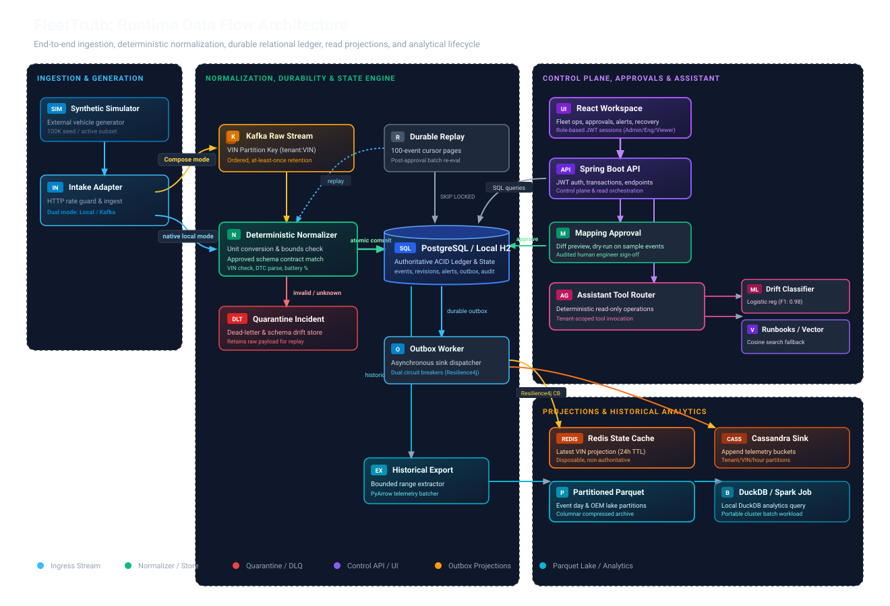
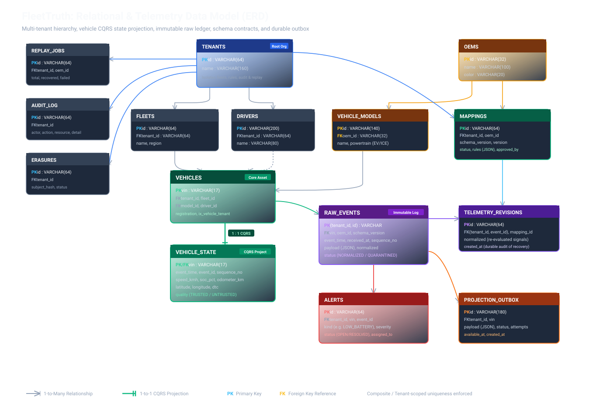

# FleetTruth

**Reliable Multi-OEM Vehicle Intelligence**

FleetTruth detects OEM schema changes, quarantines untrusted telemetry, validates versioned mappings, and recovers the original events after human approval. The demo shows why trustworthy normalization matters: a fractional battery reading must not silently become a percentage or hide a critical vehicle alert.

Independent academic hackathon project. Motorq is an industry reference, not an affiliate or integration partner. All vehicles, OEM brands, drivers and telemetry are synthetic.

## Contents

- [The problem](#the-problem)
- [The solution](#the-solution)
- [Workspace modules](#workspace-modules)
- [Architecture](#architecture)
- [Technology stack](#technology-stack)
- [Run locally](#run-locally)
- [Docker deployment](#docker-deployment)
- [Demo route](#demo-route)
- [API overview](#api-overview)
- [AI and analytics](#ai-and-analytics)
- [Verification](#verification)
- [Security and privacy](#security-and-privacy)
- [Project map](#project-map)
- [Documentation](#documentation)
- [Current scope and roadmap](#current-scope-and-roadmap)
- [Submission artifacts](#submission-artifacts)

## The problem

A mixed fleet receives telemetry from different vehicle manufacturers. The same signal can have different field names, units, types and schema versions. An OEM firmware or API change can silently break a parser and make operational decisions unreliable.

For example, the synthetic Helix OEM changes its battery contract:

| Contract | Field | Value | Meaning |
| --- | --- | ---: | --- |
| Previous schema | `state_of_charge` | `42` | Battery is 42% charged |
| New schema | `soc_fraction` | `0.42` | Battery is still 42% charged |
| Canonical output | `socPct` | `42` | Consistent percentage for fleet applications |

An old parser might drop the new field, display `0.42%`, or reuse stale battery data. Alerts and dispatch decisions would then rely on incorrect information. Speed presents a similar challenge when one OEM reports miles/hour and the fleet application expects km/hour.

**Problem statement:** How can a multi-OEM fleet platform normalize changing telemetry contracts without silently corrupting data, while retaining evidence and safely recovering affected events?

## The solution

FleetTruth makes contract changes visible and recovery controlled:

```text
Receive original telemetry
          |
Select exact approved OEM/schema mapping
          |
          +-- Known and valid --> Normalize --> Update state and alerts
          |
          +-- Unknown/invalid --> Quarantine --> Inspect source evidence
                                                   |
                                            Preview mapping rules
                                                   |
                                            Human approval
                                                   |
                                            Durable event replay
                                                   |
                                            Recovered state + audit
```

For the Helix incident, an engineer maps `/soc_fraction` to `socPct` with a scale factor of `100`. Preview validates the rules against samples before approval. Replay reprocesses the retained events rather than requiring the OEM to resend history.

- **Preserved evidence:** original payloads and normalization revisions remain inspectable, subject to explicit local erasure.
- **Exact contracts:** only approved mappings for the precise OEM/schema version run; unknown versions are quarantined.
- **Explicit validation:** VIN, type, coordinate, range and diagnostic-code checks surface invalid data.
- **Human approval:** neither ML scores nor assistant responses can approve mappings.
- **Duplicate safety:** `(tenant_id, event_id)` prevents repeated business effects from duplicate delivery.
- **Late-event safety:** historical events are retained without replacing a newer vehicle state.
- **Transactional updates:** source status, revisions, state, alerts, summaries and projection outbox changes commit together.
- **Durable recovery:** replay jobs persist their progress and page checkpoints for retry and continuation.

## Workspace modules

The React workspace has eight primary views, with an assistant and user profile accessible alongside them.

| Module | What it provides |
| --- | --- |
| Overview | Fleet counts, throughput, contract health and critical-alert summaries |
| Vehicles | Search, OEM filters, cursor pagination, latest state and vehicle details |
| Alerts | Operational alerts, source evidence and engineer/admin status updates |
| OEM integrations | Synthetic source health, schema incidents, data quality and advisory drift scores |
| Mapping studio | Source-to-canonical rules, sample preview, validation and explicit approval |
| Recovery | Durable replay jobs with progress, recovery counts and failures |
| Analytics | Historical summaries and charts backed by transactional read models |
| Audit trail | Tenant-scoped records of reads, mapping changes, recovery and other audited actions |
| Fleet assistant | Read-only questions backed by deterministic, audited evidence tools |
| User profile | Signed-in identity, role/access information, appearance preferences and logout |

Day, night and system appearance are supported. Preferences persist in the browser and synchronize between tabs. Profile identity and permissions are read-only; account editing and password changes are not implemented.

## Architecture

### Running data flow

The following diagrams are the existing assets from [Architecture and System Design](docs/ARCHITECTURE.md), embedded directly from `docs/diagrams/`.



| Component | Responsibility |
| --- | --- |
| Simulator / intake adapter | Generate or accept synthetic events; direct intake in native mode, Kafka intake in Compose |
| Kafka | Buffer raw events and partition by `tenant:VIN` for per-vehicle ordering |
| Deterministic normalizer | Apply approved rules, validate signals and accept or quarantine events |
| Spring API | Enforce authorization; expose fleet reads, mapping approval and recovery commands |
| PostgreSQL / H2 | Authoritative transactional ledger for events, mappings, state, alerts, replay, audit and summaries |
| Replay worker | Reprocess quarantined events with approved rules and durable page checkpoints |
| Outbox worker | Retry external projections while retaining pending delivery state |
| Redis | Optional latest-state projection with 24-hour TTL; not the source of truth |
| Cassandra | Optional time-bucketed telemetry projection with 24-hour TTL |
| ML / runbook retrieval | Advisory drift scoring and read-only assistance; pgvector retrieval in Compose |
| Historical export | Bounded export to partitioned Parquet, DuckDB analysis and a supplied Spark cluster job |

**Current deployment boundary:** the API, normalizer, simulator and workers share one Spring process. They are not independently deployed microservices. API reads use SQL today, not Redis; Cassandra is optional.

### Relational data model



The model separates registry identity from telemetry and recovery:

- **Registry:** tenants, fleets, drivers, OEMs, vehicle models and vehicles.
- **Telemetry:** original events, canonical revisions and latest vehicle state.
- **Recovery:** versioned mappings, replay jobs and projection outbox records.
- **Governance:** alerts, audit records and local erasure requests.
- **Read models:** transactional total, minute and day summaries avoid full-history dashboard aggregation.

Some diagram relationships are application-enforced rather than SQL foreign keys. See the [relational-model notes](docs/ARCHITECTURE.md#relational-model) for integrity boundaries.

### Reliability and tradeoffs

Kafka delivery is **at least once**. A crash between SQL commit and offset commit can cause redelivery; idempotent event identity prevents repeated effects. There is no global exactly-once guarantee across Kafka, SQL, Redis and Cassandra.

Replay uses 100-event pages, transactional checkpoints and `SKIP LOCKED` row claims. Redis and Cassandra have independent circuit breakers; failed projections remain pending in the durable outbox. Focused tests cover these mechanisms, but distributed kill-recovery and full chaos testing remain production gates.

Production evolution separates ingestion, normalization, control API, projections and historical jobs. Bulk telemetry and counters need partitioned storage and stream-maintained read models before fleet-scale throughput is attempted. The [architecture document](docs/ARCHITECTURE.md) explains CAP/PACELC, retention and capacity calculations.

## Technology stack

| Layer | Technologies | Purpose |
| --- | --- | --- |
| Frontend | React 19, TypeScript, Vite, TanStack Query, Recharts, Lucide | Operations workspace, server-state queries, charts and controls |
| API / domain | Java 21 target, Spring Boot, Spring Security, JDBC, Flyway | Typed rules, REST, JWT authorization, transactions and migrations |
| Streaming | Apache Kafka | Buffered, per-vehicle ordered intake in Docker mode |
| Authoritative storage | PostgreSQL 17 / H2 | Docker database / durable native demonstration database |
| Projections / retrieval | Redis, Cassandra, pgvector | Latest-state projection, telemetry buckets and runbook vector retrieval |
| ML | Python, NumPy, scikit-learn | Reproducible advisory drift classifier and holdout evaluation |
| Batch | PyArrow, Parquet, DuckDB; supplied Spark job | Historical export and analytics |
| Resilience / monitoring | Resilience4j, Micrometer/OpenTelemetry, Prometheus, Grafana, Jaeger | Sink isolation, metrics, traces and structured logs |
| Verification | JUnit, Testcontainers, JaCoCo, Cucumber, Pact, Playwright, pytest, Trivy | Domain, integration, workflow, coverage and security evidence |
| Infrastructure / CI | Docker Compose, nginx, Helm, Terraform, GitHub Actions | Local stack, deployment foundations and CI definitions |

Dependency versions are recorded in `api/pom.xml`, `web/package.json`, `web/package-lock.json` and `requirements.txt`. Infrastructure files are foundations, not proof of a deployed production environment.

## Run locally

Prerequisites: Java 21+, Maven 3.9+, Node 22+ and npm on `PATH`. Docker and Python are not required for the main native UI. Run from the repository root in Windows PowerShell:

```powershell
./scripts/start-local.ps1
```

The launcher builds, chooses free ports, starts background processes, and prints the workspace URL. Defaults: frontend `http://127.0.0.1:5173`, API `http://127.0.0.1:8080`. On the development machine, API port 8081 was selected because 8080 was occupied. Actual ports and process IDs are in `.runtime/servers.json`.

Wait for API readiness and initial fleet seeding before signing in. Inspect the selected addresses with `Get-Content .runtime/servers.json`. Native H2 data persists at `api/.runtime/fleettruth.mv.db`; restarts do not reset approvals or recovery history.

| Account | Password | Access |
| --- | --- | --- |
| `engineer@fleettruth.demo` | `FleetTruth2026!` | Mapping, replay and alerts |
| `viewer@fleettruth.demo` | `FleetTruth2026!` | Read-only, approximate locations |
| `admin@fleettruth.demo` | `FleetTruth2026!` | Engineer access plus local erasure |
| `other@fleettruth.demo` | `FleetTruth2026!` | Separate synthetic tenant |

Local credentials only work in local/test mode. Never expose this demo profile to the public internet. The native demo uses durable H2 storage and does not require Docker. It registers 100,000 vehicles; its live presentation stream deliberately rotates through 192 vehicles at approximately 12 events/sec. **Enrollment count is not a throughput result.**

The sun/moon control switches day and night appearance. Either account avatar opens the user profile with Account, Preferences and Access tabs. Preferences also offers System appearance; the choice is saved in this browser and synchronized between tabs. Account identity and permissions are read-only, backed by the signed-in session and `/api/auth/me`. See [UI design notes](docs/UI_DESIGN.md) for the public industry references and implementation boundaries.

```powershell
./scripts/restart-api.ps1 -Build
./scripts/stop-local.ps1
```

## Docker deployment

Generate local secrets once, then the stack starts in one Compose command:

```powershell
./scripts/configure-demo.ps1
docker compose up --build -d
docker compose ps
```

If `.env` already exists, keep it and skip `configure-demo.ps1`; the script deliberately refuses to overwrite credentials. Docker Desktop must be running with Linux containers. Initial builds and fleet seeding can take several minutes.

| Service | Address |
| --- | --- |
| Frontend | `http://127.0.0.1:3000` |
| API | `http://127.0.0.1:8082` |
| API readiness | `http://127.0.0.1:8082/actuator/health/readiness` |

Compose uses PostgreSQL + pgvector, Redis, Kafka, API and web. It seeds 100K vehicles and sends the continuing simulation through Kafka. No database or broker port is published to the host; UI and API bind to loopback.

```powershell
# Inspect API startup/connectivity errors.
docker compose logs --tail 100 api

# Stop containers while retaining persistent data volumes.
docker compose down
```

Optional Cassandra projection, after its health check is ready:

```powershell
docker compose --profile nosql up -d --wait cassandra
$env:CASSANDRA_ENABLED='true'
docker compose up -d api
```

Optional monitoring:

```powershell
./scripts/configure-demo.ps1 -Monitoring
$env:TRACING_ENABLED='true'
$env:TRACING_SAMPLE_RATE='1.0'
docker compose --profile observability up -d api prometheus grafana jaeger
```

Prometheus is at `http://127.0.0.1:9090`, Grafana at `http://127.0.0.1:3001`, and Jaeger at `http://127.0.0.1:16686`. Grafana uses user `fleettruth` and the generated password in local `.env`. Keep that file private. The local monitoring token expires after four hours; renew it and restart Prometheus. Tracing settings above apply to this PowerShell session; repeat them before a later Compose recreation to keep tracing enabled.

The complete core Compose stack, metrics and HTTP/Kafka traces were verified locally on 2 October 2026. Real Cassandra integration was verified in Testcontainers; its optional Compose service is not left running. Compose is a **single-node demo**, not an HA or encrypted production installation. Jaeger uses transient in-memory storage.

## Demo route

1. Overview: inspect real counts and the Helix contract incident.
2. OEM integrations: inspect signal quality and advisory drift probability.
3. Mapping studio: compare source `/soc_fraction` with canonical `socPct`; validate scale 100.
4. Approve the mapping explicitly, then replay quarantined events.
5. Recovery: watch the durable job finish. Alerts and audit show the recovered evidence.
6. Fleet assistant: ask about drift, fleet priorities or replay. It uses read-only audited tools.

After recovery, use **Inject schema change** to repeat the story with a new schema version. This is a demo scenario control, not a real OEM integration.

A local silent product recording at `artifacts/demo/FleetTruth-demo.webm` shows the workflow in 114.88 seconds at 1440x1000. Video files are excluded from Git; upload the recording separately if needed. A narrated explainer must still be completed for submission. The [judge brief](docs/JUDGE_BRIEF.md) provides a compact project explanation.

## API overview

Fleet endpoints require bearer authentication. Tenant identity comes from the JWT, not a caller-selected tenant parameter. These are representative implemented routes, not a complete published OpenAPI specification.

| Method and path | Purpose | Permission |
| --- | --- | --- |
| `POST /api/auth/login` | Obtain a local demo token | Valid local account |
| `GET /api/auth/me` | Read signed-in identity and roles | Authenticated |
| `GET /api/overview` | Fleet summary | Authenticated |
| `GET /api/vehicles` | Search/filter cursor-paginated vehicles | Authenticated; viewer fields restricted |
| `GET /api/vehicles/{vin}` | Vehicle state and permitted evidence | Authenticated; viewer fields restricted |
| `GET /api/oems` | OEM quality and contracts | Authenticated |
| `POST /api/ingest` | Submit telemetry | Engineer / Admin |
| `POST /api/mappings/{id}/preview` | Validate proposed mapping rules | Engineer / Admin |
| `POST /api/mappings/{id}/approve` | Approve a mapping | Engineer / Admin |
| `GET /api/replays` / `POST /api/replays` | Inspect / start replay | Authenticated read; Engineer / Admin write |
| `GET /api/events/{id}` | Source and normalized evidence | Engineer / Admin |
| `GET /api/alerts` / `PATCH /api/alerts/{id}` | Read / update alerts | Authenticated read; Engineer / Admin write |
| `GET /api/analytics` / `GET /api/audit` | Analytics / audit records | Authenticated |
| `GET /api/ml/drift` | Advisory drift scores | Authenticated |
| `POST /api/assistant` | Read-only fleet question | Authenticated |
| `GET /api/export` | Bounded NDJSON export | Engineer / Admin |
| `POST /api/privacy/erase` | Explicitly confirmed local erasure | Admin |

See the [controllers](api/src/main/java/io/fleettruth/api/) for exact request bodies and [Operations](docs/OPERATIONS.md#get-a-local-token-without-printing-it) for token-based scripts. Never commit bearer tokens or raw traces.

## AI and analytics

### Advisory drift detection

The classifier is standardized logistic regression, trained in Python and exported as coefficients for Java inference. It examines missing fields, type errors, range errors, unapproved schema changes and relative battery-distribution shifts.

The recorded evaluation used **8,000 synthetic training windows** and **2,400 holdout windows** with a different seed and lower fault severity. Positive-class F1 was approximately **0.980**, versus **0.629** for the declared fixed-threshold baseline. This does not establish accuracy on real OEM data. Deterministic contract validation remains authoritative, and the classifier cannot approve mappings. [Evaluation evidence](evidence/ml-evaluation.json).

### Read-only assistant

The assistant routes questions to deterministic, audited evidence tools and authored runbook retrieval. It is not an autonomous LLM planner. It cannot approve mappings, trigger replay or bypass tenant permissions. Compose supports pgvector-backed retrieval with a local corpus fallback.

### Historical analytics

The batch exporter pages through authenticated event data, writes partitioned Parquet and computes DuckDB summaries. A Spark job is supplied for cluster execution; a billion-row cluster run has not been verified. See [Operations](docs/OPERATIONS.md) for export commands and reproducibility limits.

## Verification

```powershell
mvn -f api/pom.xml clean verify

Push-Location web
npm ci
npm run build
npm run test:e2e
Pop-Location

python -m venv .venv
./.venv/Scripts/Activate.ps1
python -m pip install -r requirements.txt
python -m pytest ml -q
python scripts/collect-evidence.py
```

Use Python 3.12 for the Python tools to match CI. Browser tests require running services and default to port 5173. Windows tests use installed Microsoft Edge; Linux requires Playwright Chromium (`npx playwright install --with-deps chromium` from `web/`). Set `$env:APP_URL='http://127.0.0.1:3000'` before the browser tests to test Compose, or use the launcher-selected frontend URL. Real PostgreSQL/Kafka/Redis/pgvector and Cassandra tests automatically skip without Docker; CI explicitly requires Docker first. Reports: `api/target/site/jacoco`, `web/playwright-report`, `evidence`.

The latest clean backend verification passed 63 tests with no skips, including real stores, Cucumber and Pact. The browser suite passed all 20 tests against both native and Docker deployments. The evidence collector enforces at least 80% line and instruction coverage for ten explicitly named critical classes. It reports all classes and skipped tests without treating them as passes. See the [Verification Report](docs/VERIFICATION.md) for measured performance, security findings and outstanding production gates.

### Recorded results

These are local results recorded on **2 October 2026**, not live CI badges or production guarantees.

| Check | Result | Evidence |
| --- | --- | --- |
| Backend | 63 passed; no failures, errors or skips | [Totals and coverage](evidence/verification.json) |
| Browser workflows | 20 native passes and 20 Docker passes | [Native](evidence/browser-native-tests.json), [Docker](evidence/browser-docker-tests.json) |
| Core coverage | Ten named classes above 80% lines and instructions | [Coverage scope](docs/VERIFICATION.md#critical-coverage) |
| ML | Two tests passed; synthetic holdout F1 approximately 0.980 | [Evaluation](evidence/ml-evaluation.json) |
| HTTP security | 13 checks passed per environment | [Native](evidence/security-smoke.json), [Docker](evidence/docker-security-smoke.json) |
| Bounded API benchmark | p95 84.19 ms; p99 205.77 ms; 0/90 request errors | [Benchmark](evidence/local-api-benchmark.json) |
| Historical batch | 18,504 rows across four export pages | [Batch](evidence/batch-evaluation.json) |
| Application images | No HIGH/CRITICAL findings in the two final images | [API scan](evidence/api-image-audit.json), [Web scan](evidence/web-image-audit.json) |
| Observability | Metrics, Grafana health and HTTP/Kafka traces verified | [Local stack](evidence/local-stack.json) |

The API benchmark used only 90 timed reads at concurrency three on one development machine. It is not a sustained load test. The API image still had 13 MEDIUM and 16 LOW OS findings; infrastructure images were not included in these scans.

[GitHub Actions](.github/workflows/ci.yml) defines verification and security jobs. A workflow file is not proof of a successful remote run; inspect Actions after publishing the repository.

For batch export or the bounded local API benchmark, set `FLEETTRUTH_TOKEN` to a local engineer access token; see [Operations](docs/OPERATIONS.md). Do not put tokens in version control.

## Security and privacy

- JWT authentication, role checks and tenant-scoped queries protect API operations.
- Viewer accounts receive approximate coordinates and restricted raw evidence.
- Mapping approval, replay and other audited actions retain actor/resource context.
- Confirmed admin erasure handles the local authoritative store; complete cross-store deletion remains unfinished.
- `.gitignore` excludes local secrets, keys, runtime databases, raw reports/traces, dependencies, caches and generated submission bundles.

Production OIDC, device mTLS, TLS, managed secrets, encrypted stores, comprehensive denial/internal-access auditing and external erasure orchestration need real-environment implementation and verification. Full SAST/DAST is not claimed. See [Security and Privacy](docs/SECURITY.md).

## Project map

| Path | Purpose |
| --- | --- |
| `api/` | Java/Spring API, domain rules, simulator, Kafka processor, durable replay/outbox |
| `web/` | React/TypeScript operations workspace, responsive layouts, role-aware workflows |
| `ml/` | Reproducible synthetic training, baseline and holdout tests |
| `batch/` | Actual Parquet/DuckDB export; Spark cluster job |
| `tests/` | Acceptance specifications and k6 read workload |
| `infra/` | Docker, Helm/Kubernetes, AWS Terraform foundation, monitoring |
| `docs/` | Solution, architecture, requirements matrix, ADRs, security, operations and demo script |
| `evidence/` | Measured outputs, explicitly scoped |
| `docs/diagrams/` | Running data-flow and relational-model diagrams embedded above |
| `artifacts/demo/` | Local demo recording output; video files are excluded from Git |
| `.github/workflows/` | Verification and security CI definitions |
| `compose.yaml` | Local container stack and optional service profiles |
| `requirements.txt` | Python ML, batch and verification dependencies |
| `.gitignore` | Private, machine-specific and generated-file exclusions |

Commit source, configuration, lock files, diagrams, documentation and reviewed evidence. Generated videos and `artifacts/submission/` are ignored, including the extracted duplicate project. The architecture diagrams embedded above are tracked documentation assets.

## Documentation

| Document | What you will learn |
| --- | --- |
| [Solution](docs/SOLUTION.md) | Problem, approach and technical rationale |
| [Architecture](docs/ARCHITECTURE.md) | Data flow, ERD, event semantics, resilience, CAP/PACELC and capacity |
| [Requirements](docs/REQUIREMENTS.md) | Implemented, partial and pending hackathon requirements |
| [Architecture Decisions](docs/ADRS.md) | Rationale for contracts, storage, replay and deployment choices |
| [Algorithms and SQL](docs/ALGORITHMS_SQL.md) | Core processing logic and query optimization |
| [Operations](docs/OPERATIONS.md) | Lifecycle, tokens, exports, benchmarks, monitoring and deployment procedures |
| [Security](docs/SECURITY.md) | Authorization, privacy controls and remaining work |
| [UI Design](docs/UI_DESIGN.md) | Workspace design, references, accessibility behavior and profile boundaries |
| [Verification](docs/VERIFICATION.md) | Executed checks, coverage, measurements and limitations |
| [Judge Brief](docs/JUDGE_BRIEF.md) | Compact presentation-oriented project explanation |
| [References](docs/REFERENCES.md) | External background sources |

For measured claims, follow the evidence and verification report. For implementation status, consult the requirement traceability matrix. Some older submission notes in detailed documents predate generation of the solution PDF.

## Current scope and roadmap

**Implemented and locally verified:** native and core Docker deployments, exact-schema normalization, quarantine, validation/approval, durable replay, evidence-linked alerts, tenant-aware UI, profile/themes, advisory ML, real-store integrations, bounded batch export and local observability.

**Remaining production work:**

- Partition bulk telemetry ingestion/storage and shard or stream-maintain counters.
- Verify sustained 100K events/sec and five-minute 300K events/sec bursts.
- Execute billion-row batch, soak, dashboard/alert SLO and unique-event reconciliation tests.
- Establish multi-zone availability, distributed failure recovery and no-single-point-of-failure topology.
- Complete production identity, encryption, secret management and cross-store erasure.
- Add durable centralized logs/traces and comprehensive security/chaos verification.

The local vertical slice demonstrates the recovery approach. It is **not proof of every production requirement** in the hackathon brief. No cloud deployment, live OEM connection or successful remote CI run is implied. See [Requirements](docs/REQUIREMENTS.md).

## Submission artifacts

Organize the submission Drive folder into:

1. **Solution Document:** `artifacts/submission/FleetTruth_Solution.pdf`, generated using the official template. Complete the blank team and repository/video fields before final submission.
2. **Hackathon Explainer Video:** a narrated explanation of the problem, architecture and working recovery flow. The local silent recording is not a completed narrated explainer.
3. **Technical Artifacts:** the GitHub repository URL, documentation, verification evidence and optionally the source ZIP.

The generated PDF, video and ZIP remain local and are intentionally excluded by `.gitignore`. Rebuild the source/evidence/demo ZIP from the root:

```powershell
python scripts/package-submission.py
```

The packager writes `artifacts/submission/FleetTruth-submission.zip`, includes a SHA-256 manifest, and excludes credentials, databases, caches, raw test XML and browser traces. The solution PDF is a separate deliverable and is not included by this packager. Review public artifacts and ensure judges can access the repository and Drive folder before submission.
